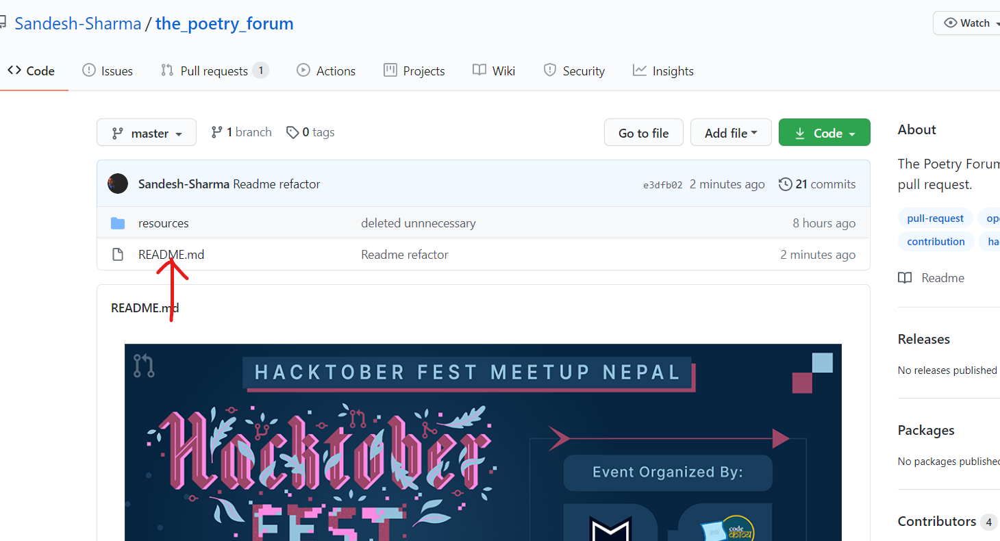
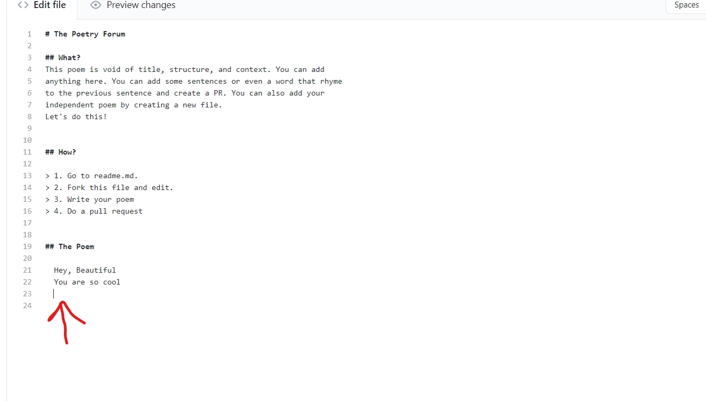
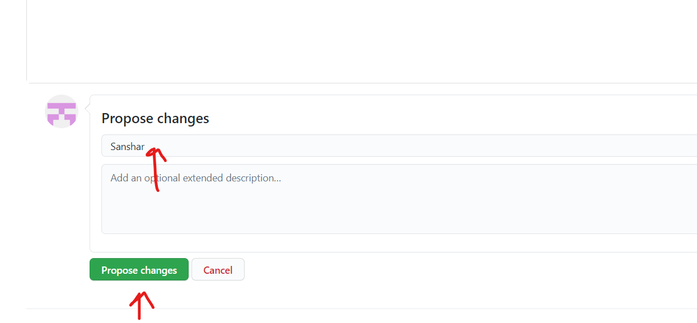
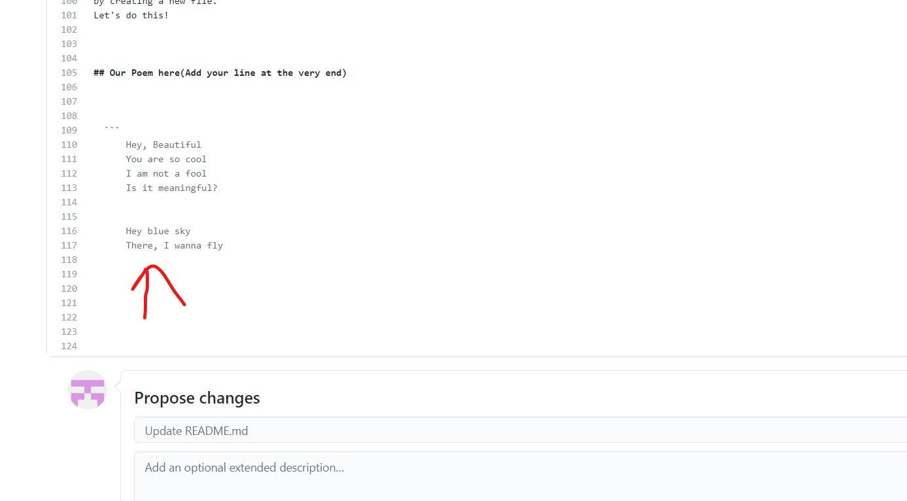
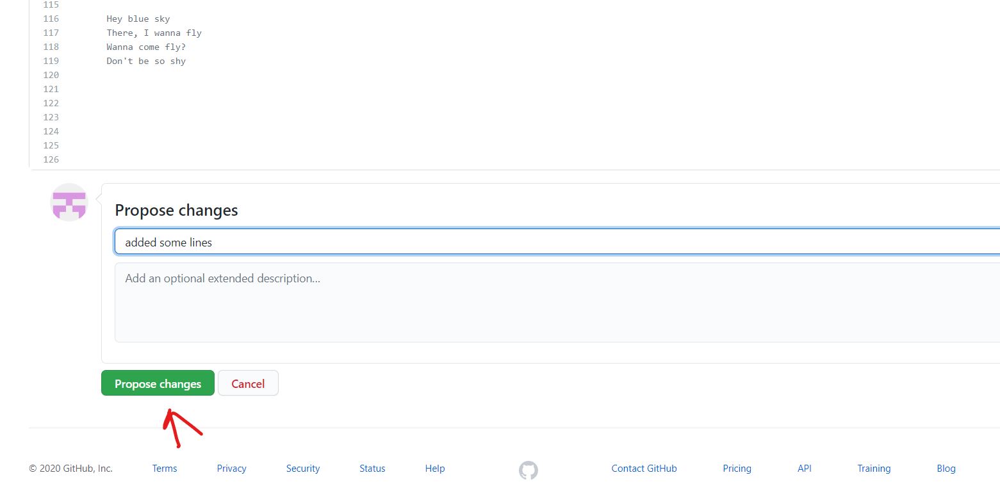
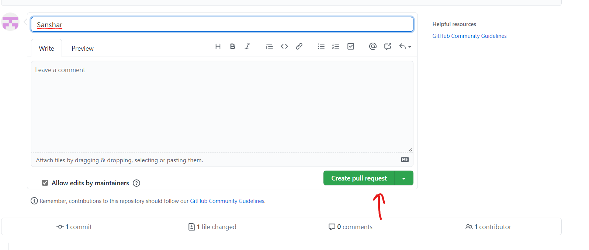
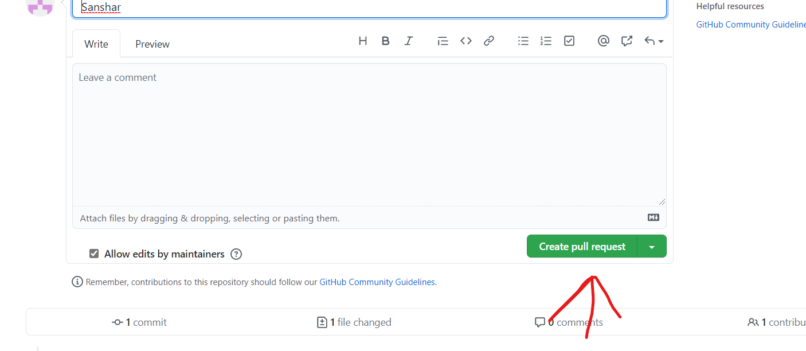

<br/>

<div align="center">
    <a href="https://hacktoberfest.digitalocean.com/">
            </img>
</a>
    <a href="https://github.com/Parajulibkrm/Hacktoberfest-Nepal/fork">
            </img>
        </a>   
    
</div>

<div align="center">
  <sub>Built with ❤︎ by
  <a href="https://twitter.com/Codekavya">Code Kavya</a> and
  <a href="https://github.com/Parajulibkrm/Hacktoberfest-Nepal/graphs/contributors">
    contributors
  </a>
</div>
  
***  
  
<br> 
<b>Read the instructions below  and make pull requests to win a tshirt from DigitalOcean. Pull requests coming from Hacktoberfest Meetup Nepal will also qualify for free host giveaway. 
        </b></p></div>

---

# ❓ What's Hacktoberfest 2020?

Hacktoberfest is the easiest way to get into open source! Hacktoberfest is a month long festival of open source code presented by [Digital Ocean](https://www.digitalocean.com/) and [DEV](https://www.dev.to/) this year in 2020.

During the entire month of October 2020, all you have to do is contribute to any open source projects and open at least 4 pull requests. Yes, any project and any kind of contributions. It can be a be a bug fix, improvement, or even a documentation change! And win a T-Shirt and awesome stickers.

If you’ve never contributed to open source before, this is the perfect time to get started because Hacktoberfest provides a large list of available contribution opportunities (and yes, there are always plenty for beginners too).

---

# 👕 Why Should I Contribute?

Hacktoberfest has a simple and plain moto.

> Support open source and earn a limited edition T-shirt!

So, yes! You can win a T-Shirt and few awesome stickers to attach on your laptop. On plus side, you will get into beautiful world of open source and get the international exposure.  
**Wait there's more!**

> Complete pull requests in repositories listed below and get the chance to win a free unlimited ssd web host.

---

# 👍 This is Awesome! How Can I Contribute?

It's very easy. You don't need to be an expert in coding and programming. Here are the steps you need to follow to create your -(maybe)- EXAMPLE first pull request within few minutes.

1. **Star this repository and Follow me on Github [here](https://github.com/Sandesh-Sharma).**
2. **Navigate to `readme.md` file**: [readme](readme.md)
   
3. **Click on the edit file, scroll down to the end and insert your line.**
   
   
   
4. **Now click on Propose button.**
   
5. **Create a new pull request.**
   
   
6. **Wait for your Pull Request to be reviewed and merged!**
7. **Enjoy and welcome to Hacktoberfest 2020 and Keep Contributing :)**

> Step 2 is required to be eligible for giveaway.

## 🔥 What will happen after my contribution?

Your line will be merged into the poem soon and you can see it in the readme.md file. 
If you have participated in Hacktoberfest Meetup Nepal and created successful pull request in all the repositories mentioned below, you'll be eligible to win a free hosting acount from our sponsor.

---

## 🤗 Other Repositories to contribute to

- [Hacktoberfest-Simple-Practice-Programmes](https://github.com/bigyanic/Hacktoberfest-Simple-Practice-Programmes)
- [Hacktoberfest-Nepal](https://github.com/Parajulibkrm/Hacktoberfest-Nepal)
- [Hacktoberfest-Nepal-2020](https://github.com/Saugat-Adhikari/Hacktoberfest-Nepal-2020)
- [Hacktoberfest](https://github.com/arjunadhikary/Hacktoberfest)


***
***


# The Poetry Forum

This poem is void of title, structure, and context. You can add anything here. You can add some sentences  
or even a word that rhyme to the previous sentence and create a PR. You can also add your independent poem  
by creating a new file.  
Let's do this!    

 
    
## Our Poem here(Add your line at the very end)


  ``` 
      Hey, Beautiful
      You are so cool
      I am not a fool
      Is it meaningful?
      i am too cool
       
      
      Hey blue sky
      There, I wanna fly
      Wanna come fly? 
      Don't be so shy
      i dont wanna die
      
      Hey, Hi! Ok Listen
      I am here on a mission.
      Pull Request? I just did it.
      Now waiting for T-shirt from DigitalOcean.
      Enjoying Hacktoberfest
      

      Hey Good Lookin'
      Whatchu got cookin'?
      


      What are heavy? Sea-sand and sorrow;
      What are brief? Today and tomorrow;
      What are frail? Spring blossoms and youth;
      What are deep? The ocean and truth.

       I am with you all guys
      because i am highfi
      don't worry about all
      that's not your foul
      
      

   # The man in a car 
   
   I once knew a man who lived in a car.
   For a stranger sight you'd have to go far.
   I asked him once why he lived in a car.
   He grimaced and said, how bizarre you are.


     like a bookmark, I accompany the your voice
     I felt solitude of conversation all over the night
     you are blessed one to born with only one choice
     As passed thousand years, it feels as if we've just met in evening light
      

      
      Hey all the work is done
      All pull request are gone
      Sky with bight sun
      Thanks to DIGITALOCEAN
      
      Other love  October
      we love hacktober
      

      Roses are red
      Voilets are blue
      i can't rhyme
      just like you

      

      I don't care 
      Don't you dare
      east or west 
      I'll try to win a T-shirt from Hacktober fest

      My phone has been hacked,
      I feel gladdened to know, that

      Aju bro sleep with his cat,
      I alwaya fail in math
      thankYou For the poem, 
      you are handsome man,


      
      Hey, Are You lost?
      Come, gain our trust
      We are never at rush
      we're codeKavya's Workers
      feeling happy haha

      fear of falling
      it keeps you away from your dream #coding
      

      Fix 5 errors,
      Get 10 more free.

      All are learning     
      With fire burning
      Everyone is trying their best
      To get that T-shirt heist.
      
      Yeah,i have just completed a request for a pull	
      To get T-Shirt is not What I wanted all,	
      To contribute to opensource is my longterm goal.	
      	
      	
      Hey dude!	
      boost up your mood.	
      participating in this fest	
      With the proudness in your chest.
      

      I came here for hacktober fest
      This will be my third pull request
      
      Poem is just getting longer
      
      #hey do i know you 
      Hey , do i even know you?
      i am here before you (lol bad poem)

      
      
      I tell a story
      Through my lines
      my story is not mine
      I'm truly just on borrowed time


      approve pull request with 
      hactoberfest-accepted
      as per new update
      from hactoberfest 2020
      
      # Do not expect to hear a love story from me,
       The moon will come to hear story of another moon from me.

       # I wish we had an evening like this..
       Get out on a moon panel and come on roof.
       
       Roaming in the sky
       lonely as a cloud
       For those all your works 
       I am feeling really proud
    
      
       
       
       East or west 
       Imagination is best
       
       Goodbye, my love

        Say good night
        I cry every night
        I thought about it every single day
        don't mourn for me

        For I may never find you
        For you may never find me
        It is how it is Dear!!
        Will it be over Ever?
        Hey, my sunshine
        Let's dine and wine
        We'll be fine
        Under a vine
        And beyond ninety nine!!
        

        hello bro how are you?
        i am fine how do you do?
        i am missing you so much
        i am eating food so much
        
         
        I have a little cat
        his name is pat
        he sleeps on the mat
        he caught a big rat


        ## "if i had only wish
        then i know what that would be
        i'd wish that how i feel
        for you is how you'd feel for me." ##
        

        There is something on me
        and i am asking for the ghee
        and thats again me
        
        I came here after 14 days, 
        to complete my hacktoberfest challange.
        Looking to the Repo,
        My laptop is my bebo.
        


        Humans are defined by their tragedy
        Money, resource and assets are the forecoming reality
        Why shouldn't we be curious???
        When the brain itself is eager to interprete its anatomy
        What shall define us
        Our humanity, mentality, spirituality or financial capacity,
        Our insanity can't withstand the duality
        Why shouldn't we be curious
        When love itself reveals the brutality?

	      ## Thought 
	      The challenge of thought finds
	      ourselves in constant 
	      questioning of our own beliefs

	From east to west 
	Python is The Best
